# Eye Diagram for PCM  M - ary

This repo contain a Eye Diagram of a PCM M-ary, with a Raised Cosine Filter, Noise's Effect and Band Width Restrictions.

For M = 2, we have a Binary Comunication System, but for more symbols, we need M > 2.

## Raised Cosine Filter

For α (Roll-off) in `[0 , 0.5 , 0.75 ,1]` your perfomance is:

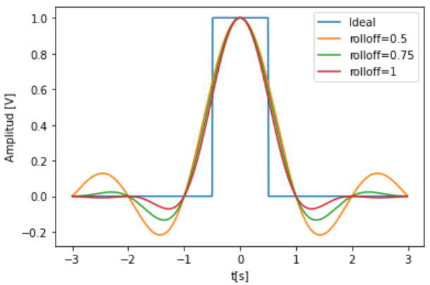

## Eye Diagram For M = 2 without Noise

With a Digital System without Noise, The ideal eye diagram don't have ISI and your perfomance will be clear.

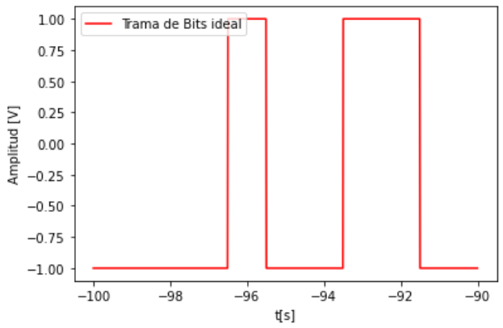

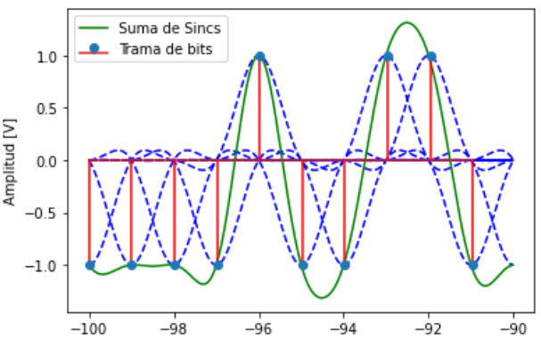

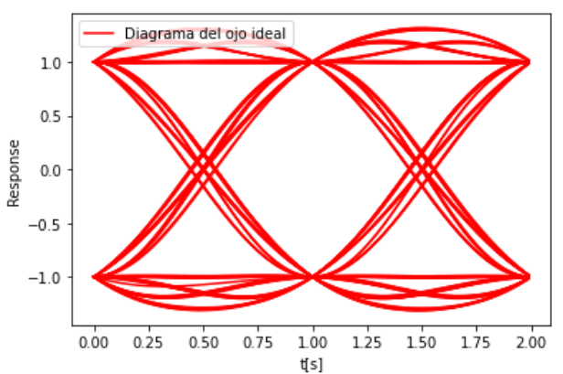

## Eye Diagram For M = 2 with Noise

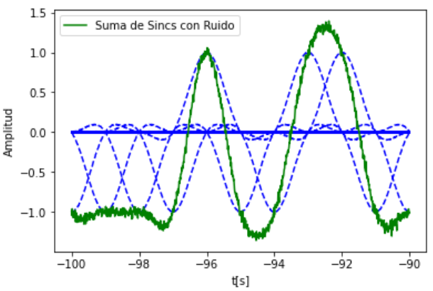

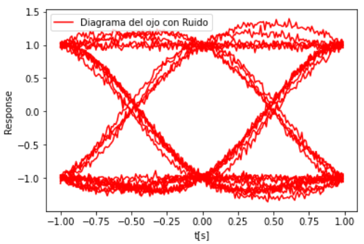

## Eye Diagram For M = 2 with Noise and LowPass Filter fc=0.975

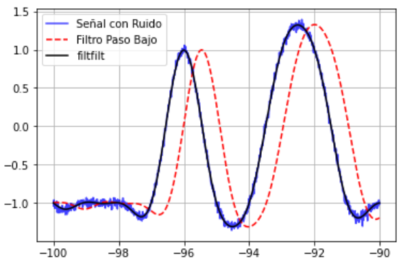

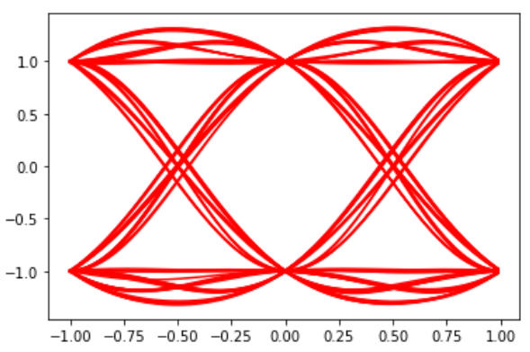

---

## Eye Diagram For M = 4 without Noise

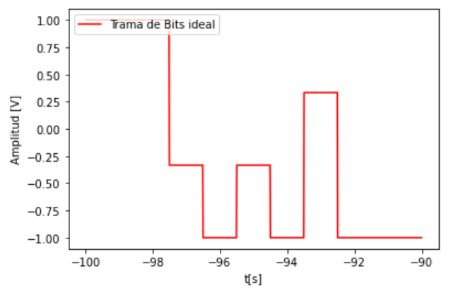

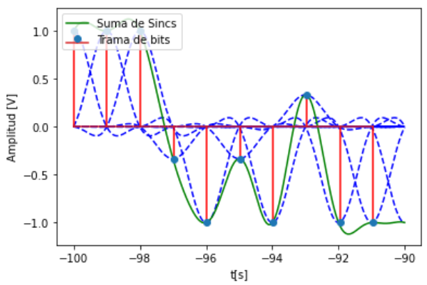

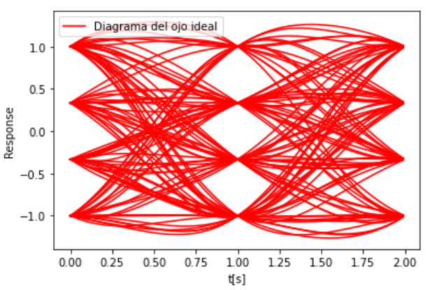

## Eye Diagram For M = 2 with Noise

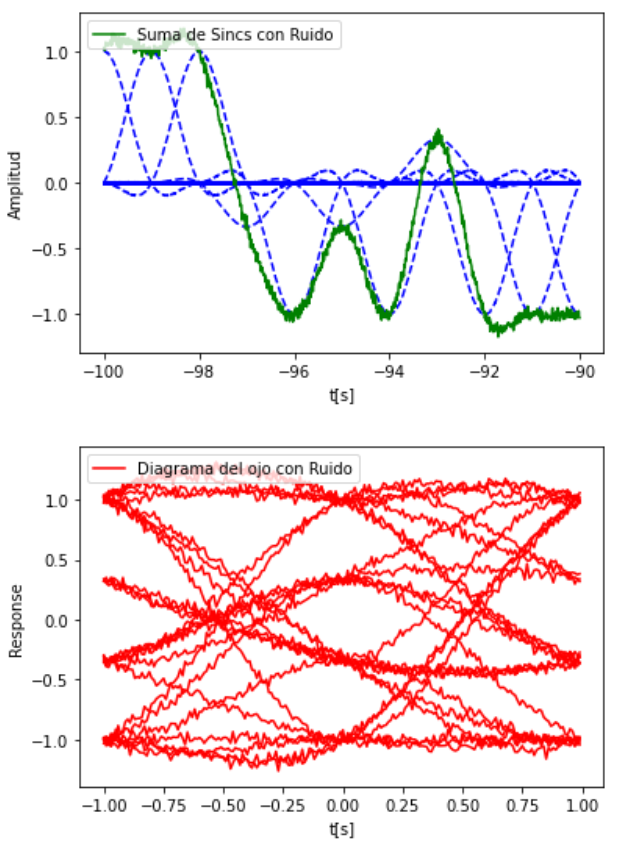

## Eye Diagram For M = 2 with Noise and LowPass Filter fc=0.975

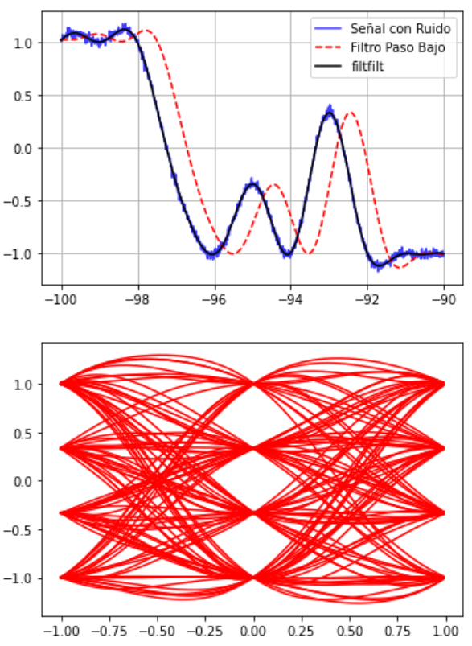
